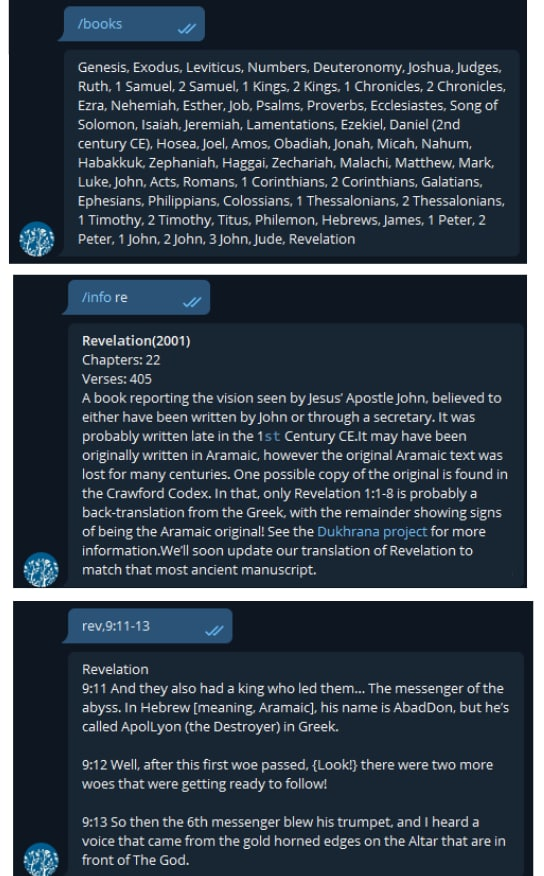
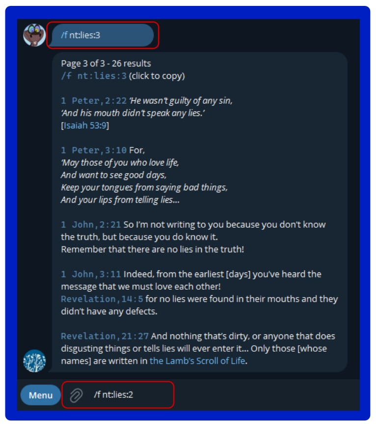

# Bible Horse
----

## Applications

### BH.Importer 

Converts a given 2001 Bible translation from html document into a Sqlite database.

See `ConnectionStrings` for path and database file.

### BH.TelegramBot.Service

A bot for telegram to return verses via a query over message. Telegram BOT: https://t.me/Bible2001Bot

#### Commands

`start` - Displays welcome message

`books` - Returns list of available books from this Bible

`info` - Send with a short book title name to retrieve information

`find` - Run command on it's own for help on how to use the search

`set_devine_name` - Change from the default Jehovah

`set_gods_son` - Change from the default Jesus

`set_anointed_one` - Change from the default Anointed One (Christ)

#### Verses / Books
---

Must be in the format of {book},{chapter}:{verseRange}

`rev,9:11-13` = Will return Revelation Chapter 9, verses 11-13

`gen,6:2-5` = Will return Genesis Chapter 6, verses 2-5

`gen,1:1` = Will return Genesis Chapter 1 verse 1

#### Find / Search Command

---

`/find gossip` = Search whole Bible for gossip

`/find luke:jesus` = Search Luke for Jesus

`/find ot:anger` = Search Old testament for anger

`/find nt:gossip` = Search New testament for gossip

`/f nt:drunk:2` = Search NT for drunk and set a page number

